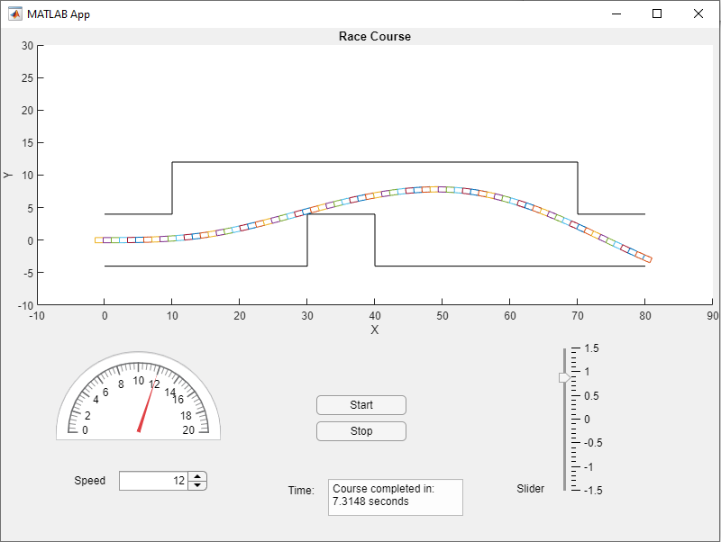

# Steering-Dynamics-Live-Sim

MATLAB simulation of a car's position with steer angle controled by the user, completed for M E 419 at Iowa State University. TThe The car's velocity is assumed constant for each run, but can be adjusted between runs. The car's steering angle is determined with the slider to the right. The position of the vehicle is determined by use of the Euler method. The racetrack is generated from IGS data export from SOLIDWORKS and read by the program from Racetrack.xlsx.

The following image shows the app after succesfully completing the course:

